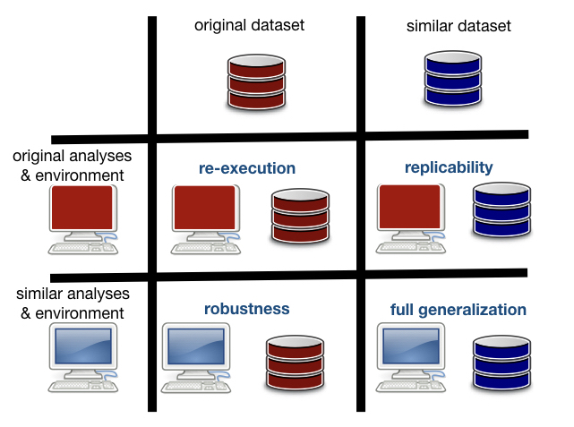
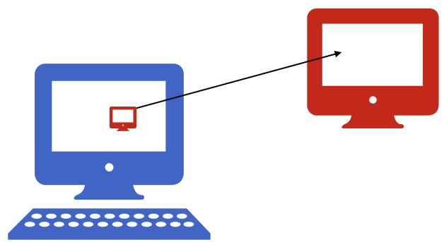
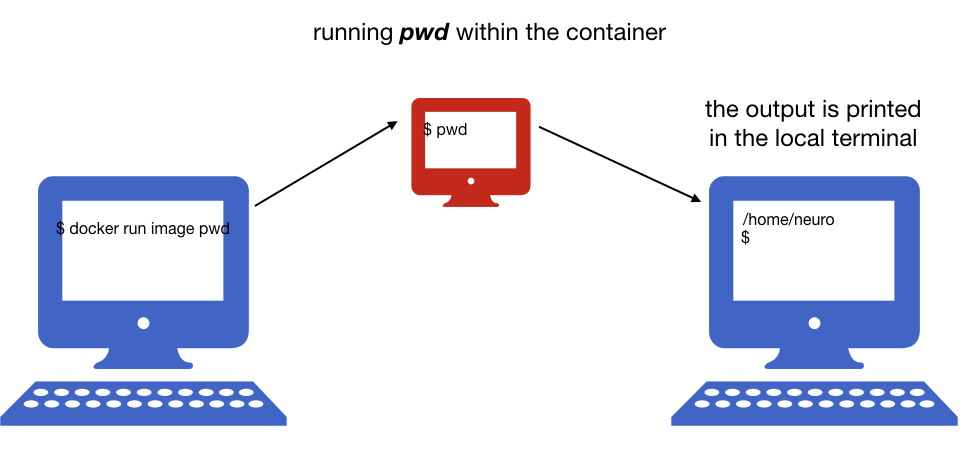
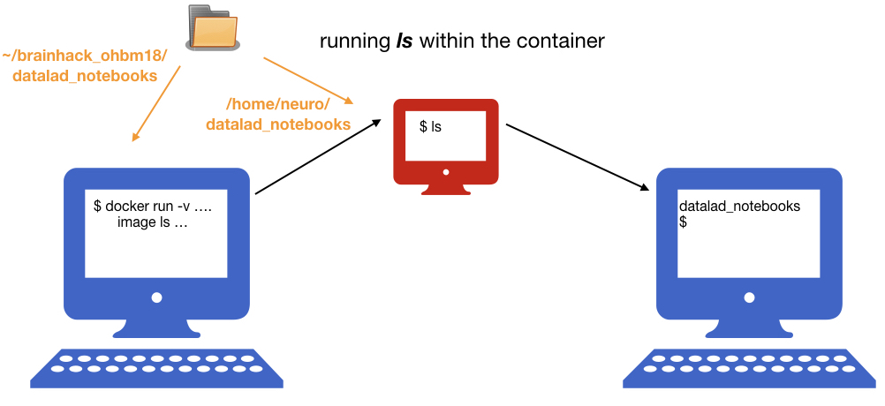
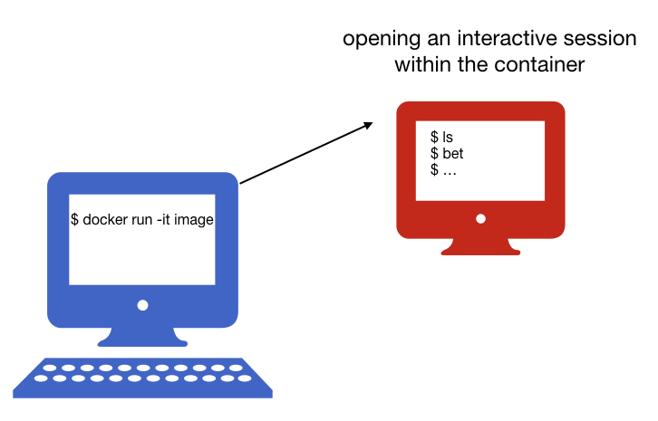

name: inverse
layout: true
class: center, middle, inverse
---
# Reproducibility Basics

---
name: inverse
layout: true
class: center, middle, inverse
---
## Introduction

---
layout: false

### <span style="color:purple">Spectrum of the reproducibility</span>


&nbsp;



---
layout: false

### <span style="color:purple">Thinking about the reproducibility</span>


&nbsp;

**Before the workflow can be reproducible, it has to be "controllable":**
--

- you should start controlling:
&nbsp;

  - computational environment

  - code

  - data

--

&nbsp;

- existing tools can help you:
&nbsp;

  - container technologies: controlling your environment

  - git/github (or bitbucket, gitlab...): controlling your code

  - datalad: controlling your data (and much more! :)
 
--

** Controlling these elements can also solve other problems at your lab ..:-)**

---
name: inverse
layout: true
class: center, middle, inverse
---
## Container technologies


---
layout: false

### <span style="color:purple">What are the container technologies</span>


&nbsp;

- #### Isolate the computing environments

&nbsp;

- #### Allow to encapsulate environments in a self-contained unit that can run anywhere

---

### <span style="color:purple">Why do we need containers?</span>

### Science Reproducibility

  - Each project in a lab depends on complex software environments
    - operating system
    - drivers
    - software dependencies: Python/MATLAB/R + libraries
&nbsp;


  - Containers:
    - allow to encapsulate your environment
    - you (and others!) can recreate the environment later in time

---
### <span style="color:purple"> Why do we need containers?</span>

### Collaboration with your colleagues


- Sharing your code or using a repository might not be enough
&nbsp;


- Containers:
  - encapsulate your environment
  - you can easily share the environment


---
### <span style="color:purple"> Why do we need containers?</span>

### Changing hardware 

- The personal laptop might not be enough at some point 
&nbsp;


- Containers:
  - encapsulate your environment
  - you can easily recreate the environment on a different machine


---

###<span style="color:purple">Why do we need containers?</span>

### Freedom to experiment!

- Universal Install Script from xkcd: *The failures usually don’t hurt anything...*
 And usually all your old programs work...


- Containers:
  - isolate the environments
  - you can do whatever you want and remove anytime

---
### <span style="color:purple"> Why do we need containers?</span>


### Using existing environments


- Installing all dependencies is not always easy.
&nbsp;


- Containers:
  - isolate and encapsulate the environments
  - there are many ready to use existing environments

---
### <span style="color:purple">What does it mean to work in a container</span>

If you are running a container on your laptop
- it uses the same hardware
- but user spaces and libraries are independent

--




---
### <span style="color:purple">What does it mean to work in a container</span>

If you are running a container on your laptop
- it uses the same hardware
- but user spaces and libraries are independent
- you can create additional bindings between these two environments


---

layout: false

### <span style="color:purple">Containers Technologies</span>

- Two main types:

  - Virtual Machines:

      - Virtualbox
      - VMware
      - AWS, Google Compute Engine, ...

  - Containers:

      - Docker
      - Singularity
&nbsp;

--

- Main idea -- isolate the computing environment

  - Allow regenerating computing environments
  - Allow sharing your computing environments


---
### <span style="color:purple">Virtual Machines vs Containers</span>


--

 **Virtual Machines**
  - emulate whole computer system (software+hardware)
  - run on top of a physical machine using a *hypervisor*
  - *hypervisor* shares and manages hardware of the host and executes the guest operating system
  - guest machines are completely isolated and have dedicated resources
---
### <span style="color:purple">Virtual Machines vs Containers</span>

  


   **Docker containers**
  - share the host system’s kernel with other containers
  - each container gets its own isolated user space
  - only bins and libs are created from scratch
  - **containers are very lightweight and fast to start up**


---
### <span style="color:purple">How  do we choose the technology</span>

There is no one solution that always works, your choice should depend on:
- which hardware is available to you (also do you require GPU)
- where is your data stored
- Docker might me the most portable technology right now, but...
  - if you use HPC centers you will have to use Singularity instead.


---
###<span style="color:purple">Docker and Singularity </span>
- **Docker:**
  - leading software container platform
  - an open-source project
  - it runs now on Mac OS X and Windows Pro (you don't have to install VM!)
  - can escalate privileges - not supported by HPC centers admins 

--

- **Singularity:**
  - a container solution created for scientific application
  - supports existing and traditional HPC resources
  - a user inside a Singularity container is the same user as outside the container 
(so you can be a root only if you were root on the host system)
  - VM needed on OSX and Windows
  - a Singularity image can be created from a Docker image


---
name: inverse
layout: true
class: center, middle, inverse
---
### Docker: Exercises

---

name: inverse
layout: true
class: center, middle, inverse
---
### Exercise 1: Installing Docker
---
layout: false

#### Installation process depends on your operating system!

- follow the instruction: https://neurohackweek.github.io/nhw2017/setup/#docker

- testing Docker installation:

  ```bash
docker run hello-world
  ```

---
name: inverse
layout: true
class: center, middle, inverse
---
### Creating a Docker image
---
layout: false

- #### In order to create a docker image we need to write a Dockerfile, that contains all the commands a user could call on the command line to assemble an image. Dockerfile provide a “recipe” for an image.

  - a simple Dockerfile might look like this

  ```bash
  FROM ubuntu:latest
  RUN apt-get update -y && apt-get install -y git emacs
  ```

---
layout: false
  - a more complicate Dockerfile with FSL and python might look like this 

```bash
FROM neurodebian:stretch-non-free

ARG DEBIAN_FRONTEND="noninteractive"

ENV LANG="en_US.UTF-8" \
    LC_ALL="en_US.UTF-8" \
    ND_ENTRYPOINT="/neurodocker/startup.sh"
RUN export ND_ENTRYPOINT="/neurodocker/startup.sh" \
    && apt-get update -qq \
    && apt-get install -y -q --no-install-recommends \
           apt-utils \
           bzip2 \
           ca-certificates \
           curl \
           locales \
           unzip \
    && apt-get clean \
    && rm -rf /var/lib/apt/lists/* /tmp/* /var/tmp/* \
    && sed -i -e 's/# en_US.UTF-8 UTF-8/en_US.UTF-8 UTF-8/' /etc/locale.gen \
    && dpkg-reconfigure --frontend=noninteractive locales \
    && update-locale LANG="en_US.UTF-8" \
    && chmod 777 /opt && chmod a+s /opt \
    && mkdir -p /neurodocker \
    && if [ ! -f "$ND_ENTRYPOINT" ]; then \
         echo '#!/usr/bin/env bash' >> "$ND_ENTRYPOINT" \
    &&   echo 'set -e' >> "$ND_ENTRYPOINT" \
    &&   echo 'if [ -n "$1" ]; then "$@"; else /usr/bin/env bash; fi' >> "$ND_ENTRYPOINT"; \
    fi \
    && chmod -R 777 /neurodocker && chmod a+s /neurodocker

ENTRYPOINT ["/neurodocker/startup.sh"]

RUN apt-get update -qq \
    && apt-get install -y -q --no-install-recommends \
           fsl-5.0-core \
           fsl-mni152-templates \
    && apt-get clean \
    && rm -rf /var/lib/apt/lists/* /tmp/* /var/tmp/*

RUN sed -i '$isource /etc/fsl/5.0/fsl.sh' $ND_ENTRYPOINT
```

---
layout: false

### [Neurodocker - generate custom images](https://github.com/kaczmarj/neurodocker)

&nbsp;

  - It supports Docker and Singularity.	

  - It supports many packages used in neuroimiging, 
including FSL, AFNI, ANTs, FreeSurfer, SPM12,  Python.

  - It can minimize existing containers.

&nbsp;
&nbsp;

  - Creating a Dockerfile from Neurodebian:

  ```bash 
  docker run --rm kaczmarj/neurodocker:master generate docker \
  --base neurodebian:stretch-non-free \
  --pkg-manager apt \
  --install fsl-5.0-core fsl-mni152-templates \
  --add-to-entrypoint "source /etc/fsl/5.0/fsl.sh"

  ```

---
name: inverse
layout: true
class: center, middle, inverse
---
### Exercise 2: Creating a Docker image with Datalad

---
layout: false

### Building a Docker image with Datalad and jupyter notebook

- creating a Dockerfile
```bash
bash create_dockerfile.sh
```

- building a Docker image:

```bash
docker build -t ohbm_datalad .

```

- checking available Docker images:

```bash
docker images
```

---
name: inverse
layout: true
class: center, middle, inverse
---
## Exercise 3: Running python notebook within the container
---
layout: false

- running container
```bash
docker run ohbm_datalad
```
--


---
layout: false

- running command within the container
```bash
docker run ohbm_datalad pwd
```
--




---
layout: false

- mounting a local directory to the container: 
```bash
docker run -v /path/to/datald/notebooks:/home/neuro/notebooks ohbm_datalad ls
```
--




---
layout: false

- running an interactive session:
```bash
docker run -it image
```
--




---
layout: false

- running jupyter notebook from the interactive session:

  - openning an interactive session with `-p` option to publish ports
```bash
docker run -it --rm -v $PWD:/home/neuro/notebooks -p8888:8888 ohbm_datalad:latest
```

  - opening jupyter notebook within docker
```bash
jupyter notebook
```

  - copy-paste the link to your browser 
(you might have to change the beginning, so it looks like: `localhost:8888/?token=a8adf033622e90ce9bb09a61c7c1e788caf5e8a0bd099e54&token=a8adf033622e90ce9bb09a61c7c1e788caf5e8a0bd099e54`

---
layout: false

- checking running containers
```bash
docker ps
```

- checking all containers
```bash
docker ps -a
```

- removing a container
```bash
docker rm <container id>
```

- removing all containers that stopped running 
```bash
docker rm $(docker ps -a -q)
```

- **use `--rm` option to remove the container after it exits**, e.g.: 
```
docker run --rm  fsl ls
```

